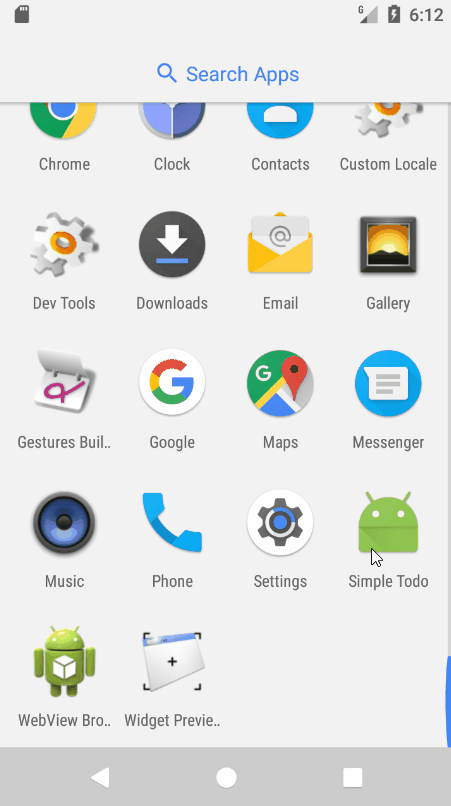
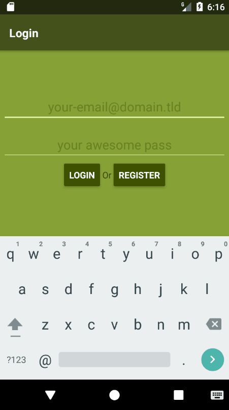

# React Native Relay Classic Sample Todo App

This project is the result of a code challenge made for a job 
  opportunity at [@entria](https://github.com/entria), and also as a self-learning project, since I didn't know anything about React Native at the time. 

It was made using Relay Classic, since at the time, it was the bleeding edge version, and yeah, I got the job using it.

I've no plans on updating it any further, there is a relay-modern port on the [`feature/relay-modern`](https://github.com/JCMais/react-native-todo-app/tree/feature/relay-modern) branch. I'm keeping it only for historical reasons now.

### Server

The included server is based on [@entria/graphql-dataloader-boilerplate](https://github.com/entria/graphql-dataloader-boilerplate),
 created using the awesome tool  [create-graphql](https://github.com/lucasbento/create-graphql).

### Demo

#### Challenge Entria

##### Create a React Native app
- [x] it should run on both iOS and Android (I cannot test on iOS, but it _should_ run)
- [x] it should use Relay
- [x] it should use one or more of the schemas available on https://www.graphqlhub.com/ or our boilerplate https://github.com/entria/graphql-dataloader-boilerplate
- [x] it should show the content inside a ListView (a list of reddit or hackernews or github or twitter or a mix of them)
- [x] it should be open sourced on your github repo 
